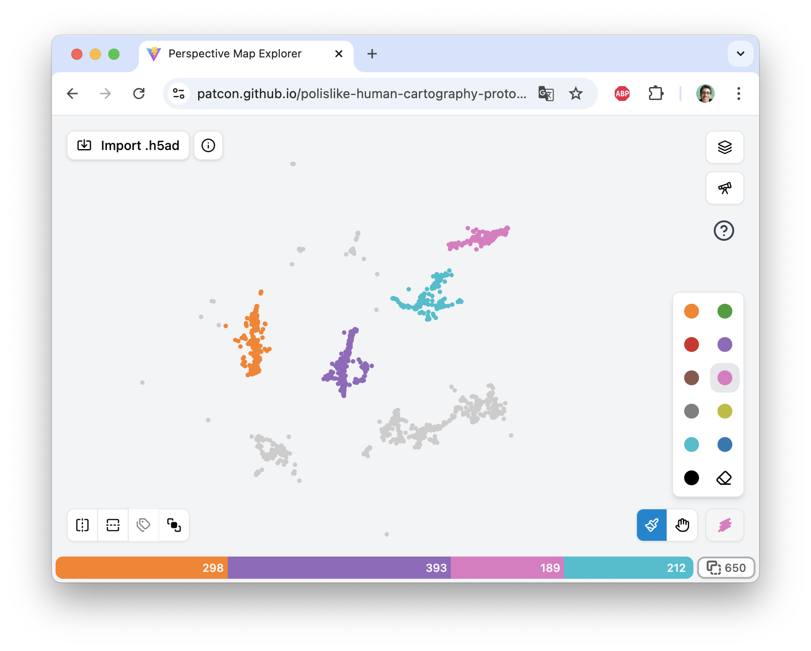
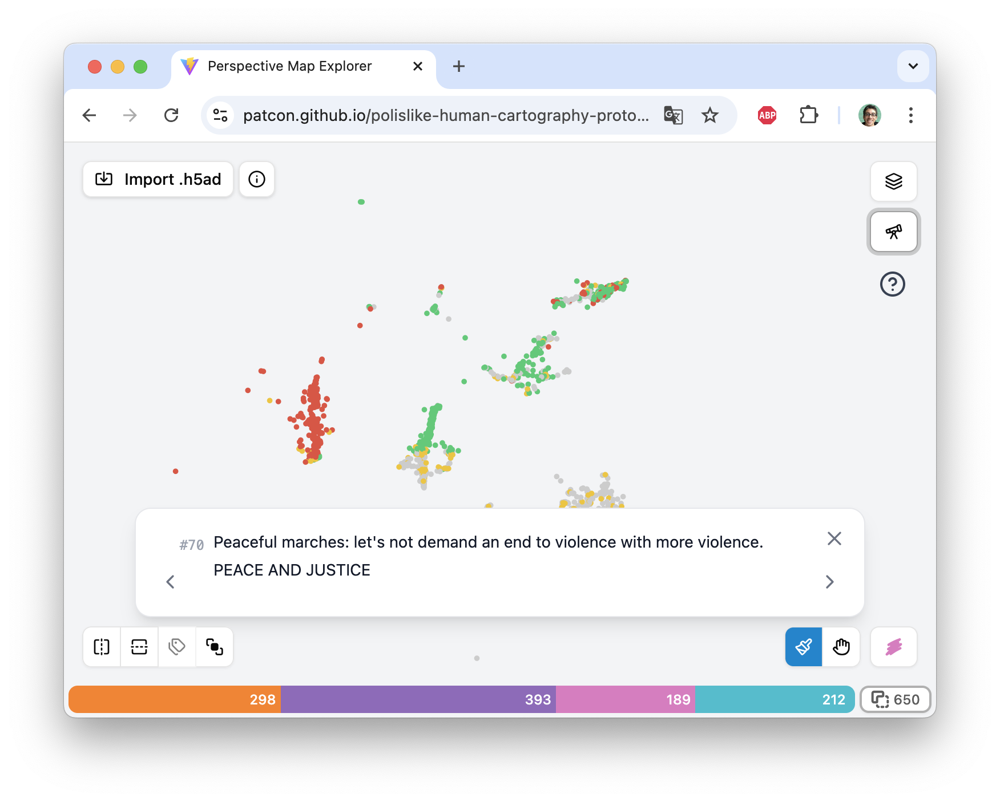
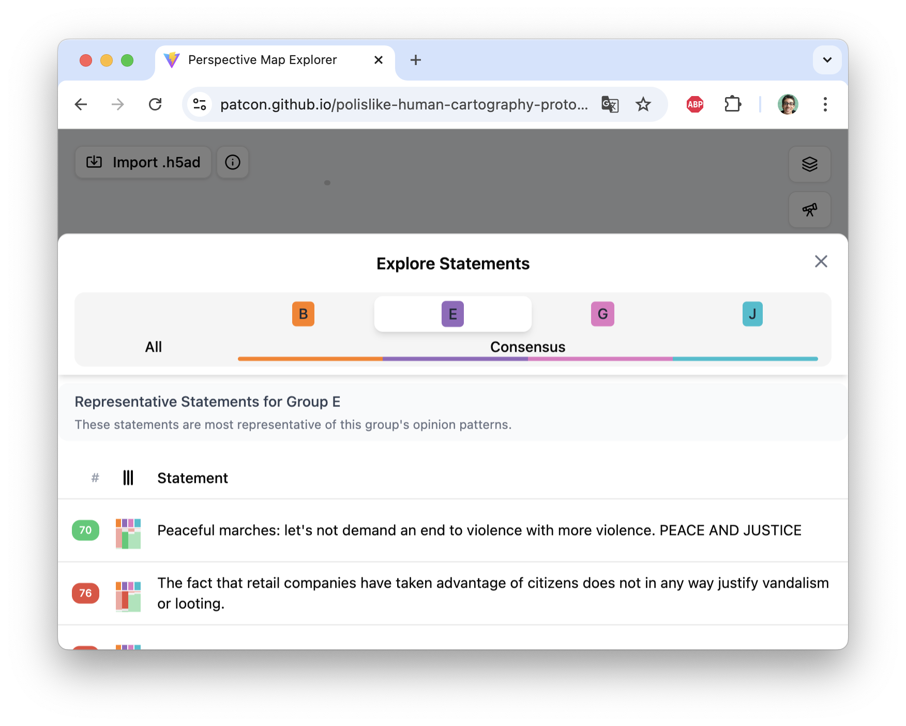
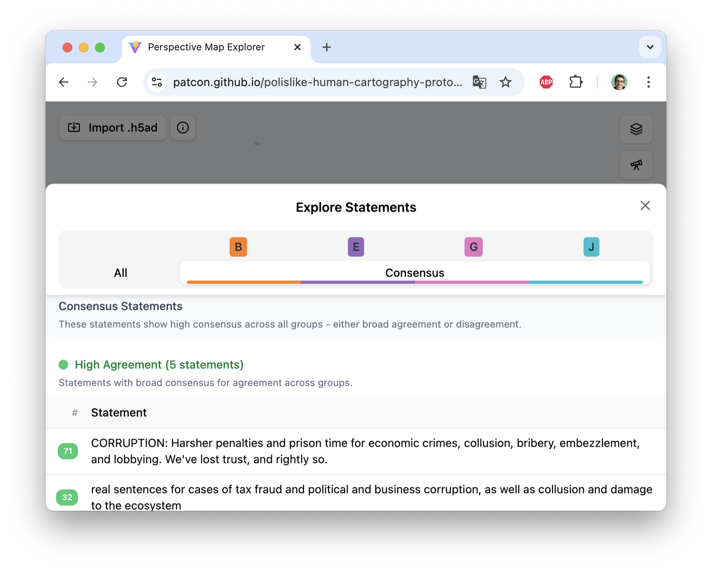
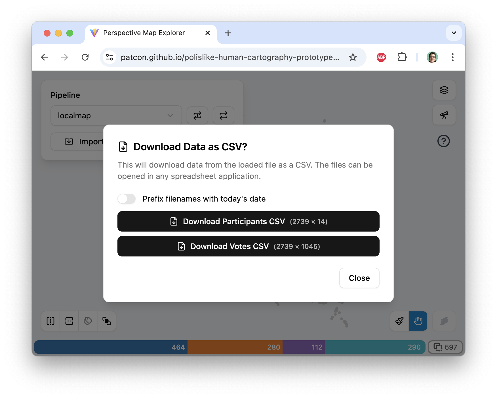
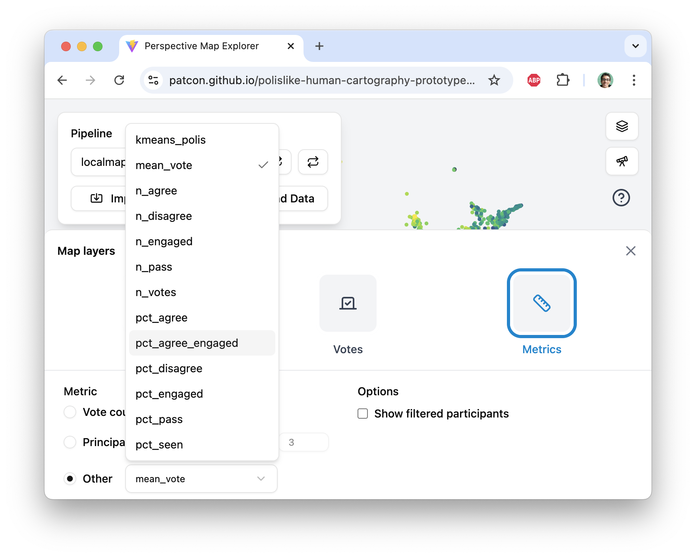
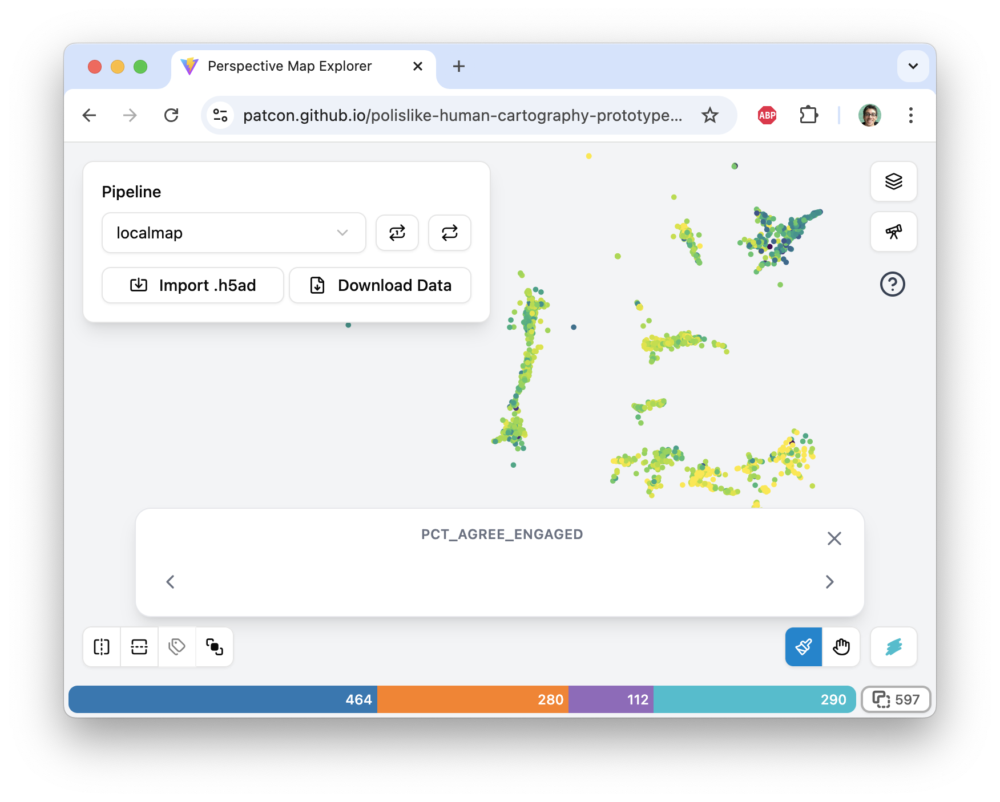
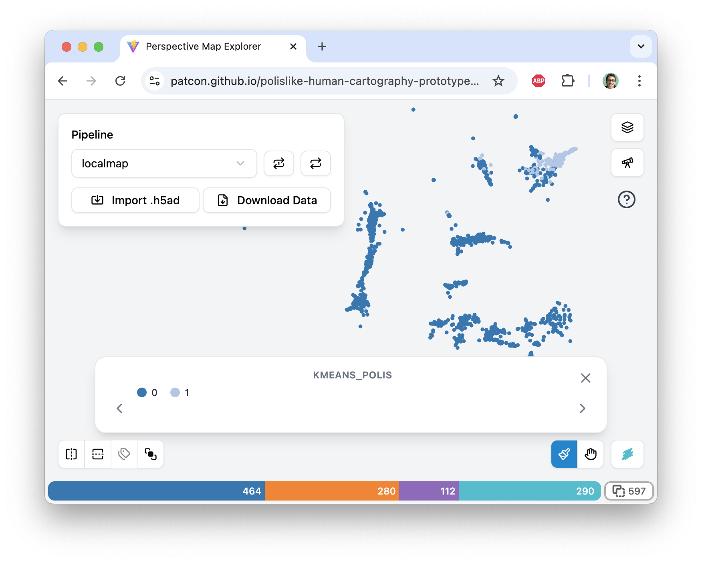
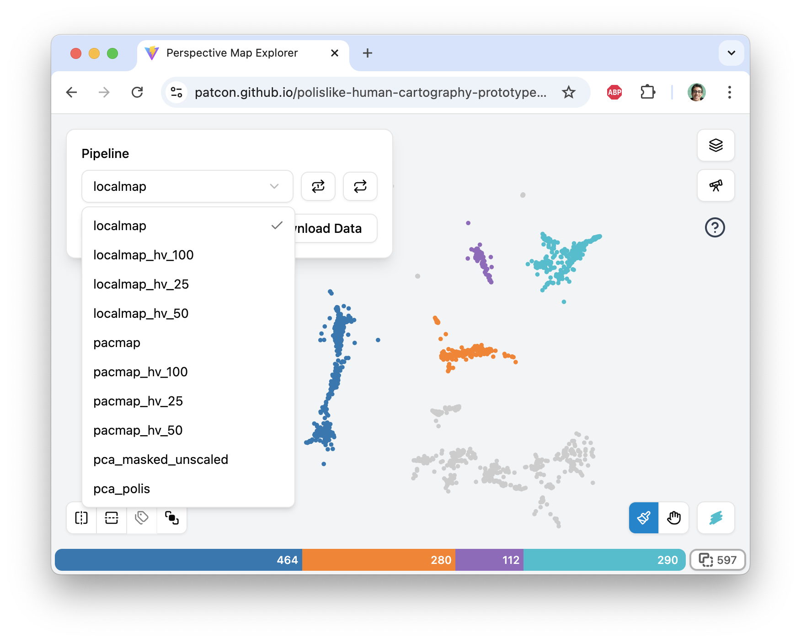

<div align="center">

# Perspective Landscape Painter

<br />
**A map-like interface for exploring opinion landscapes.**<br />
Paint participant groups, reveal hidden consensus, and surface what divides us.<br />
<sub>Built on polis-like opinion data. Runs entirely in the browser — no backend required.</sub>


<sup>

[Discord][discord] |
[Weekly Call Notes][notes] |
[Storybook][storybook] |
[Interface Demos][walkthrough]

</sup>


---

[](https://github.com/patcon/polislike-human-cartography-prototype-v2/actions/workflows/deploy-gh-pages.yml)
[](https://main--68c53b7909ee2fb48f1979dd.chromatic.com/)
[](https://polislike.short.gy/discord)
[](https://www.youtube.com/playlist?list=PLMgSnvCsIgoFrVNXlpbEgSDtaJ7q_fx0l)

[discord]: https://polislike.short.gy/discord
[notes]: https://polislike.short.gy/notes
[storybook]: https://main--68c53b7909ee2fb48f1979dd.chromatic.com/
[walkthrough]: https://www.youtube.com/playlist?list=PLMgSnvCsIgoFrVNXlpbEgSDtaJ7q_fx0l

<hr />
</div>

## 🙌 Get Involved

This project is part of the broader [Polislike](https://polislike.short.gy/discord) community — a group exploring tools and ideas around computational democracy and opinion mapping.

- **[Join the Discord](https://polislike.short.gy/discord)** — chat with contributors and users
- **[Weekly call notes & schedule](https://polislike.short.gy/notes)** — we hold a regular open call; all are welcome

---

## ✨ Features

- **Perspective map**: D3-powered SVG scatter plot projecting participants into a 2D opinion space
- **Group painting**: Lasso tool to paint participant clusters and compare their voting patterns
- **Vote heatmaps**: Per-statement agree/disagree/pass overlays across the map
- **Metrics layers**: Vote-count and principal-component intensity visualizations
- **Representative statements**: Automatically surfaces distinguishing statements per painted group using in-browser DuckDB SQL
- **h5ad import**: Load any `.h5ad` (AnnData) file directly in the browser — no server upload needed. Generate compatible files from Polis report URLs using the [Streamlit export tool](https://valency-anndata-export-test.streamlit.app/), or programmatically with the [valency-anndata](https://github.com/patcon/valency-anndata) Python library
- **Parameter explorer**: Side-by-side comparison of algorithm configurations for the data processing pipeline
- **CSV export**: Download vote data as CSV for further analysis

---

## 🛠 Technologies Used

- **[Vite](https://vitejs.dev/)** — build tooling and dev server
- **[React](https://react.dev/)** + **TypeScript** — UI framework
- **[D3](https://d3js.org/)** — SVG map visualization
- **[DuckDB-WASM](https://duckdb.org/docs/api/wasm/overview.html)** — in-browser SQL queries over Parquet vote data
- **[h5wasm](https://github.com/usnistgov/h5wasm)** — in-browser HDF5/h5ad file reading
- **[shadcn/ui](https://ui.shadcn.com/)** (new-york style) + **[Radix UI](https://www.radix-ui.com/)** — accessible UI components
- **[Tailwind CSS v4](https://tailwindcss.com/)** — utility-first styling
- **[Storybook](https://storybook.js.org/)** + **[Chromatic](https://www.chromatic.com/)** — component development and visual regression testing
- **[Vitest](https://vitest.dev/)** — unit testing

---

## 🖼 Screenshots

| Paint colored groups of participants onto perspective map | For any statement, see participant votes on map |
|---|---|
|  |  |

| See which statements differentiate groups | See which statements straddle all groups |
|---|---|
|  |  |

| Download participant data or vote data to CSV | View any participant data layer on any projected map |
|---|---|
|  |  |

| View continuous data layers mapped onto participants | View discrete categorical data layers mapped onto participants |
|---|---|
|  |  |

| Select and animate between different map projections |
|---|
| <div align="center"><sub>↓ links to video</sub><br>[](https://i.imgur.com/d6wmQhb.mp4)</div> |

---

## 🧪 Experiments

Prototype explorations hosted on [Storybook][storybook]:

- **[Magic Paint](https://main--68c53b7909ee2fb48f1979dd.chromatic.com/iframe.html?globals=&args=&id=experiments-magicpaintexperiment--default&viewMode=story)** — auto-paint participant clusters by sweeping hierarchical clustering thresholds
- **[Routing](https://main--68c53b7909ee2fb48f1979dd.chromatic.com/iframe.html?globals=&args=&id=experiments-routingexperiment--default&viewMode=story)** — route a path through the urban and rural parts of the latent space of human values
- **[Concave Hulls](https://main--68c53b7909ee2fb48f1979dd.chromatic.com/iframe.html?globals=&args=&id=experiments-concavehullexperiment--default&viewMode=story)** — draw concave hull boundaries around painted groups

---

## 💻 Development

### Prerequisites

- [Node.js](https://nodejs.org/) (see `.nvmrc` or `package.json` for version)
- `pnpm`

### Getting started

```bash
git clone https://github.com/patcon/polislike-human-cartography-prototype-v2.git
cd polislike-human-cartography-prototype-v2
pnpm install
pnpm run dev
```

The app will be available at `http://localhost:5173`.

### Other useful commands

```bash
pnpm run build        # TypeScript check + production build
pnpm run test         # Vitest in watch mode
pnpm run test:run     # Vitest single run (CI)
pnpm run lint         # ESLint
pnpm run storybook    # Storybook on port 6006
```

### Data format

See [docs/data-format.md](docs/data-format.md) for the full `.h5ad` (AnnData) file format the app expects.

---

## 📦 Packages

This repository uses pnpm workspaces. The app lives at the root; reusable packages live under `packages/`.

### `packages/reddwarf-ts`

A standalone TypeScript library for polis-style representative statement and consensus analysis. Contains the core statistical functions (z-tests, repness metrics, group vote matrix queries) extracted from the app. Algorithms originally derived from [raykyri/osccai-simulation](https://github.com/raykyri/osccai-simulation/tree/main/src/utils).

Works with any labeled grouping of participants — k-means, HDBSCAN, manual, or any other clustering. Requires a DuckDB-compatible connection with a `votes` table loaded by the caller.

See [`packages/reddwarf-ts/README.md`](packages/reddwarf-ts/README.md) for installation and usage.

---

## 🤝 Contributing

Contributions are welcome! This project is developed with the assistance of [Claude Code](https://claude.ai/code), which means **a well-written GitHub issue is often enough to get a feature built or a bug fixed** — no code required from contributors.

To contribute:

1. **Open an issue** describing the feature or bug clearly. Include context, expected behaviour, and any relevant examples or screenshots.
2. If you want to take a crack at it yourself, fork the repo, make your changes on a feature branch, and open a pull request referencing the issue.
3. For discussion or questions, use the issue tracker or [join the Discord](https://polislike.short.gy/discord).

The clearer the issue spec, the easier it is to hand off to an AI-assisted workflow. Think of a good issue as a mini design doc: what problem does it solve, and how should it behave when done?
